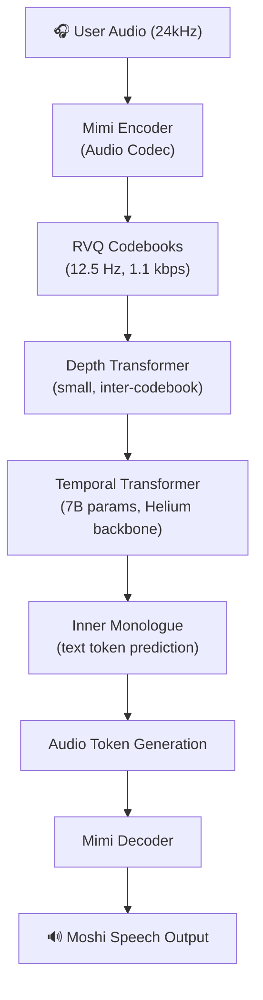

# 🎤 MoshiLite: Compressing Moshi to a Sub-3B Speech-to-Speech Model (v10)

## Project Overview

**Goal:** Compress Kyutai's **Moshi** (~7.69B params) into a high-quality, real-time speech-to-speech dialogue model with **< 3 billion parameters**, targeting efficient on-device or edge deployment.

**Scope:** This plan covers a **30% max layer pruning** variant. Other team members are independently exploring 40% and 50% pruning variants and are outside this plan's scope.

> [!IMPORTANT]
> **v10 changes from v9:**
> 1. **Training data pivot:** Replaced ~3,020 hours of real ASR audio (LibriSpeech, LibriLight, LibriMix, AMI) with **teacher self-play synthetic conversations**. Rationale: ASR datasets are out-of-domain for Moshi's conversational behavior and produced low-quality teacher targets.
> 2. **Phase 0 simplified:** No more multi-dataset download/encoding pipeline. Just environment, weights, and baseline evaluation.
> 3. **Stage 2 expanded:** Added **unstructured pruning comparison track** (Wanda/SparseGPT) for research contribution.
> 4. **Stage 4a reworked:** Self-play data generation replaces teacher pre-computation on real audio.
> 5. **Stage 4b expanded:** Added **loss function ablation grid** (5 configurations) before full-scale training.
> 6. **GDrive structure simplified:** Removed `tokens/` directory, replaced `teacher_targets/` with `self_play_data/`.
>
> **v10.1 changes (Stage 4a improvements):**
> 1. **Conversation length:** 30 seconds → **5 minutes** (3,750 steps). Matches Fisher dataset scale; eliminates greeting-dominated data.
> 2. **Text repetition penalty:** CTRL-style penalty on recently-generated text tokens during generation prevents conversation loops.
> 3. **Quality filtering v2:** Repetition now computed on non-PAD tokens only (old filter was useless due to ~88% PAD inflation). Added second-half repetition check.
> 4. **Multi-person parallel generation:** Batch naming convention + merge workflow for distributed data generation across team members.
> 5. **Automatic session resume:** `generate_batch()` detects existing `.npz` files and skips them on restart. Zero progress lost on session crash.
> 6. **Hidden states deferred:** Not saved during initial generation. If L3/L5 wins ablation, a smaller targeted dataset is generated later.

---

## Compute & Infrastructure Constraints

> [!IMPORTANT]
> This plan is designed around **Google Colab Free/Pro** and **Kaggle** as the primary compute platforms, with **Google Drive (1.9 TB)** as persistent storage. All stages are designed to fit within these constraints.

| Resource               | Colab Free                    | Colab Pro                        | Kaggle                                |
|------------------------|-------------------------------|----------------------------------|---------------------------------------|
| **GPU**                | T4 (15 GB VRAM)              | L4 (22.5 GB) / A100 (40 GB)     | T4×2 (15 GB each) or P100 (16 GB)    |
| **Session Limit**      | ~12 hrs, ~90 min idle timeout | ~24 hrs                          | ~30 hrs                               |
| **Local Disk**         | ~110 GB                      | ~230 GB                          | ~70 GB                                |
| **Persistent Storage** | Google Drive (1.9 TB)        | Google Drive (1.9 TB)            | Kaggle Datasets (limited)             |

### Key Constraint: Memory Budget

| Model Configuration             | VRAM      | Fits on T4?                          |
|----------------------------------|-----------|--------------------------------------|
| Full Moshi (FP16)                | ~15.4 GB  | ❌ No room for anything else         |
| Full Moshi (INT8)                | ~7.7 GB   | ✅ Inference only                    |
| Full Moshi (INT4/GPTQ)          | ~3.8 GB   | ✅ Comfortably                       |
| Student (~3.2–3.5B, FP16)       | ~6.4–7 GB | ✅ For training                      |
| Teacher (INT8) + Student (FP16) | ~14.7 GB  | ❌ No room for activations/optimizer |

> [!CAUTION]
> **Online knowledge distillation (teacher + student in memory simultaneously) does NOT fit on a T4.** This plan uses **offline distillation** — the teacher generates self-play data and pre-computes targets in Stage 4a, then the student trains independently against stored targets in Stage 4b.

---

## Google Drive Directory Structure

```
MyDrive/
└── moshilite/
    ├── upstream_weights/               # IMMUTABLE — original model weights
    │   └── moshiko/                    # HuggingFace snapshot of Moshi
    │
    ├── self_play_data/                 # v10: Self-play generated data (replaces tokens/ + teacher_targets/)
    │   ├── conversations/             # Raw self-play token sequences (both channels)
    │   │   ├── batch_000/             # Each batch = one generation session
    │   │   ├── batch_001/
    │   │   └── ...
    │   ├── targets/                    # Extracted teacher targets from self-play
    │   │   ├── logits/                # Sparse top-K logits (text + audio heads)
    │   │   ├── hidden_states/         # Optional: aligned layer hidden states (only if L3/L5 loss wins ablation)
    │   │   └── codebook_preds/        # All 8 RVQ codebook predictions
    │   ├── seeds/                      # Seed prompts and noise vectors used for generation
    │   │   └── seed_manifest.json     # Maps each conversation to its seed for reproducibility
    │   └── manifest.json              # Index: conversation ID → duration, seed, quality metrics
    │
    ├── checkpoints/{experiment_id}/    # MUTABLE — training state, per experiment
    │   ├── kd/
    │   │   └── {variant}_{loss}/       # Checkpoints keyed by variant and loss (e.g. v1_scattered_nonuni_L2)
    │   │       ├── checkpoint_best.pt
    │   │       ├── checkpoint_latest.pt
    │   │       └── checkpoint_final.pt
    │
    ├── models/                         # Final exported models
    │   ├── manifest.json               # Auto-generated: maps each model to its source checkpoint + metrics
    │   ├── pruned_variants/            # Stage 2: structured + unstructured pruned variants
    │   │   ├── v1_scattered_nonuni.pt
    │   │   ├── v2b_contiguous_nonuni.pt
    │   │   ├── v3_collapse_nonuni.pt
    │   │   ├── magnitude_30pct.pt      # v10: unstructured comparison (baseline)
    │   │   ├── wanda_30pct.pt          # v10: unstructured comparison
    │   │   ├── sparsegpt_30pct.pt      # v10: unstructured comparison
    │   │   └── ...
    │   ├── {variant}_{loss}_kd.pt      # Final distilled model (e.g. v1_scattered_nonuni_L2_kd.pt)
    │   ├── moshilite_int8.pt           # After quantization
    │   ├── moshilite_int4_awq.pt       # After quantization
    │   └── moshilite.gguf
    │
    ├── eval/
    │   ├── baseline/                   # Baseline full-Moshi metrics (run once in Phase 0)
    │   │   ├── metrics.json
    │   │   ├── baseline_summary.json
    │   │   ├── component_baseline/     # Component-level references for post-prune comparison
    │   │   │   ├── component_results.json
    │   │   │   ├── component_baseline.json
    │   │   │   └── hidden_states.pt
    │   │   └── sqa/
    │   ├── {experiment_id}/            # Per-experiment, per-stage results
    │   │   ├── stage1_analysis/
    │   │   ├── stage2_post_prune/      # Stage 2 quick eval results
    │   │   ├── stage2_unstructured/    # v10: unstructured pruning comparison results
    │   │   ├── stage3_depth_compat/
    │   │   ├── stage4_loss_ablation/   # v10: loss function ablation results
    │   │   ├── kd/
    │   │   │   └── {variant}_{loss}/   # Post-KD Mimicking Evaluation results
    │   │   │       ├── pre_kd_eval.json
    │   │   │       ├── post_kd_eval.json
    │   │   │       ├── full_eval_results.json
    │   │   │       └── training_summary.json
    │   │   └── stage6_post_quant/
    │   └── sqa_benchmarks/             # Audio question files (shared, run once)
    │
    └── logs/{experiment_id}/           # W&B local backup, training logs
```

### Automation Built Into the Structure

| What | How | When |
|------|-----|------|
| **Config snapshot** | `save_config()` copies current `config.yaml` into `checkpoints/{exp_id}/` | Automatically at training start |
| **Model manifest** | `export_model()` appends entry to `models/manifest.json` with source checkpoint path, metrics, timestamp | Automatically on every model export |
| **Experiment ID** | Set once in config; all paths auto-scoped via `get_experiment_dir()` helper | All stages |
| **Eval routing** | `run_eval()` auto-saves results to `eval/{exp_id}/{stage}/` based on current stage | Every eval call |
| **Self-play manifest** | `log_self_play_session()` records seed, duration, quality metrics per conversation | Every self-play batch |

```python
# === AUTOMATION HELPERS (src/moshilite/utils/experiment.py) ===

import json, shutil, yaml
from pathlib import Path
from datetime import datetime

GDRIVE_ROOT = Path("/content/drive/MyDrive/moshilite")

def get_experiment_dir(experiment_id: str, subdir: str) -> Path:
    """Returns the experiment-scoped directory, creating it if needed.
    
    Usage:
        ckpt_dir = get_experiment_dir("prune30_kd_v1", "checkpoints")
        eval_dir = get_experiment_dir("prune30_kd_v1", "eval/stage2_post_prune")
        log_dir  = get_experiment_dir("prune30_kd_v1", "logs")
    """
    path = GDRIVE_ROOT / subdir.replace("{experiment_id}", experiment_id)
    if "{experiment_id}" not in subdir:
        if subdir in ("checkpoints", "logs"):
            path = GDRIVE_ROOT / subdir / experiment_id
        elif subdir.startswith("eval/"):
            # eval/stage2_post_prune → eval/{experiment_id}/stage2_post_prune
            stage = subdir.split("/", 1)[1]
            path = GDRIVE_ROOT / "eval" / experiment_id / stage
        else:
            path = GDRIVE_ROOT / subdir
    path.mkdir(parents=True, exist_ok=True)
    return path


def save_config_snapshot(experiment_id: str, config: dict):
    """Auto-saves the exact config used for a run alongside its checkpoints."""
    ckpt_dir = get_experiment_dir(experiment_id, "checkpoints")
    config_path = ckpt_dir / "config.yaml"
    config["_saved_at"] = datetime.now().isoformat()
    config["_experiment_id"] = experiment_id
    with open(config_path, "w") as f:
        yaml.dump(config, f, default_flow_style=False)
    print(f"✅ Config snapshot saved to {config_path}")


def update_model_manifest(
    model_filename: str,
    source_checkpoint: str,
    experiment_id: str,
    metrics: dict,
):
    """Auto-appends an entry to models/manifest.json on every model export."""
    models_dir = GDRIVE_ROOT / "models"
    models_dir.mkdir(parents=True, exist_ok=True)
    manifest_path = models_dir / "manifest.json"

    manifest = []
    if manifest_path.exists():
        with open(manifest_path) as f:
            manifest = json.load(f)

    manifest.append({
        "model": model_filename,
        "source_checkpoint": source_checkpoint,
        "experiment_id": experiment_id,
        "metrics": metrics,
        "exported_at": datetime.now().isoformat(),
    })

    with open(manifest_path, "w") as f:
        json.dump(manifest, f, indent=2)
    print(f"✅ Manifest updated: {model_filename} → {manifest_path}")


def save_eval_results(experiment_id: str, stage: str, results: dict):
    """Auto-routes eval results to the correct experiment/stage directory."""
    eval_dir = get_experiment_dir(experiment_id, f"eval/{stage}")
    eval_dir.mkdir(parents=True, exist_ok=True)
    results_path = eval_dir / "results.json"
    results["_experiment_id"] = experiment_id
    results["_stage"] = stage
    results["_saved_at"] = datetime.now().isoformat()
    with open(results_path, "w") as f:
        json.dump(results, f, indent=2)
    print(f"✅ Eval results saved to {results_path}")
```

### GDrive Storage Budget

| Item                                       | Size            | Permanent?               |
|--------------------------------------------|-----------------|--------------------------|
| **Moshi weights** (`upstream_weights/`)    | ~15 GB          | ✅ Yes                   |
| **Self-play conversations** (`self_play_data/conversations/`) | ~5-15 GB | ✅ Yes          |
| **Self-play targets** (`self_play_data/targets/`) | ~15-30 GB | ✅ Yes                  |
| **Pruned model variants** (up to 9 × ~7 GB) | ~25-63 GB     | ⚠️ Keep best 2, delete rest |
| **Model checkpoints** (~10 × ~7 GB)       | ~70 GB          | ✅ Yes                   |
| **Quantized models** (INT4/INT8)           | ~5-10 GB       | ✅ Yes                   |
| **Eval artifacts + logs**                  | ~5 GB           | ✅ Yes                   |
| **Total**                                  | **~110-160 GB** |                          |

> [!NOTE]
> v10 storage is **~60 GB smaller** than v9 (~170-220 GB) because we no longer store ~30-40 GB of pre-encoded Mimi tokens from real audio datasets. Self-play data is more compact because the teacher generates tokens directly (no raw audio encoding step).

---

## GitHub Repo Structure

> [!IMPORTANT]
> **v10 changes:** Added `self_play/` module, `unstructured_pruning.py`, renamed `04a_teacher_precomputation.ipynb` → `04a_self_play_generation.ipynb`, added `04_loss_ablation.ipynb`, replaced `encode_tokens.py` → `generate_self_play.py`.

```
moshilite/
├── README.md
├── .gitignore
├── pyproject.toml
│
├── notebooks/
│   ├── 00_setup_and_baseline.ipynb          # v10: simplified — setup + weights + baseline only
│   ├── 01_layer_analysis.ipynb
│   ├── 02_structured_pruning.ipynb
│   ├── 02b_unstructured_pruning.ipynb       # v10: Wanda/SparseGPT comparison
│   ├── 03_depth_transformer_eval.ipynb
│   ├── 04a_self_play_generation.ipynb       # v10: replaces teacher_precomputation
│   ├── 04c_loss_ablation.ipynb              # v10: loss function experiment grid
│   ├── 04b_student_kd_training.ipynb
│   ├── 06_quantization.ipynb
│   └── 08_lora_finetuning.ipynb             # Optional
│
├── scripts/
│   ├── generate_self_play.py                # v10: self-play data generation
│   ├── precompute_teacher.py                # Teacher target extraction from self-play data
│   ├── export_model.py
│   └── run_sqa_eval.py
│
├── src/moshilite/
│   ├── __init__.py
│   ├── self_play/                           # v10: NEW — self-play data generation
│   │   ├── __init__.py
│   │   ├── generator.py                     # Self-play conversation generator (dual-channel)
│   │   ├── seeding.py                       # Seed prompt library + noise vector generation
│   │   ├── target_extractor.py              # Extract logits, hidden states, codebooks from runs
│   │   └── quality_filter.py                # Filter out degenerate/collapsed conversations
│   ├── data/                                # DataLoader for self-play targets
│   │   ├── __init__.py
│   │   └── dataset.py                       # Self-play target dataset + DataLoader
│   ├── analysis/                            # Layer importance, BI scores
│   │   ├── __init__.py
│   │   ├── moshi_hooks.py                   # Forward hooks for hidden state / attention capture
│   │   └── run_stage1.py                    # Stage 1 analysis orchestrator
│   ├── pruning/                             # Structured + unstructured pruning
│   │   ├── __init__.py
│   │   ├── depth_pruning.py
│   │   ├── layer_collapse.py
│   │   ├── head_pruning.py
│   │   ├── ffn_pruning.py
│   │   ├── unstructured_pruning.py          # v10: Wanda/SparseGPT wrappers
│   │   └── variant_runner.py
│   ├── distillation/                        # KD losses, student training loop
│   │   ├── __init__.py
│   │   ├── losses.py                        # v10: Multiple loss configurations (L1–L5)
│   │   ├── alignment.py
│   │   ├── trainer.py
│   │   ├── evaluator.py                     # v10: Mimicking evaluation on self-play val split
│   │   ├── precompute.py
│   │   └── depth_finetune.py
│   ├── eval/
│   │   ├── __init__.py
│   │   ├── component_eval.py
│   │   ├── sqa.py
│   │   ├── metrics.py
│   │   ├── quick_eval.py
│   │   ├── codebook_eval.py
│   │   └── dialogue_metrics.py
│   └── utils/
│       ├── __init__.py
│       ├── experiment.py
│       └── precision.py                     # Precision validation helpers (cosine drift, KL-div, etc.)
│
├── configs/
│   ├── stage1_analysis.yaml
│   ├── stage2_pruning.yaml
│   ├── stage4a_self_play.yaml               # v10
│   ├── stage4c_loss_ablation.yaml           # v10
│   ├── stage4b_training.yaml
│   └── stage6_quantization.yaml
│
└── tests/
    ├── test_self_play.py                    # v10
    ├── test_pruning.py
    ├── test_kd_losses.py
    ├── test_checkpoint_resume.py
    └── test_experiment_helpers.py
```

### Session Startup (First Cell of Every Notebook)

```python
# === SESSION STARTUP ===
from google.colab import drive
drive.mount('/content/drive')

import subprocess, sys

REPO = "https://github.com/<your-username>/moshilite.git"
REPO_DIR = "/content/moshilite"

if not __import__("os").path.exists(REPO_DIR):
    subprocess.run(["git", "clone", REPO, REPO_DIR], check=True)
else:
    subprocess.run(["git", "-C", REPO_DIR, "pull"], check=True)

subprocess.run([sys.executable, "-m", "pip", "install", "-e", REPO_DIR, "-q"], check=True)
```

### Debugging Workflow with Antigravity

1. Share error message / cell output here
2. Antigravity edits the relevant `.py` file in the repo
3. Run `!git -C /content/moshilite pull && pip install -e /content/moshilite -q` in Colab
4. Re-run the cell

---

## Moshi Architecture Recap



| Component                         | Params | Role                                                            |
|-----------------------------------|--------|-----------------------------------------------------------------|
| **Temporal Transformer** (Helium) | ~7B    | Core LLM backbone — models temporal/conversational dependencies |
| **Depth Transformer**             | ~small | Models inter-codebook dependencies per timestep                 |
| **Mimi** (Audio Codec)            | ~small | Encodes/decodes audio; uses RVQ; 80ms frame latency            |
| **Total (Moshiko/Moshika)**       | ~7.69B | Full fine-tuned model                                           |

> [!IMPORTANT]
> The **Temporal Transformer is the primary compression target** (~90%+ of params).
> The **Depth Transformer must be re-evaluated** after any change to the Temporal Transformer due to tight representational coupling.

---

## Compression Strategy

```mermaid
graph LR
    P["Phase 0<br/>Setup + Baseline"] --> A["Stage 1<br/>Layer Analysis"]
    A --> B["Stage 2<br/>Multi-Variant Pruning<br/>(structured + unstructured)"]
    B --> B2["Stage 2b<br/>Quick Eval<br/>(Two-Round Protocol)"]
    B2 --> C["Stage 3<br/>Depth Transformer<br/>Compatibility Check"]
    C --> T["Stage 4a<br/>Self-Play Data<br/>Generation"]
    T --> AB["Stage 4-ablation<br/>Loss Function<br/>Ablation"]
    AB --> D["Stage 4b<br/>Student KD Training<br/>(Best Loss Config)"]
    D --> F["Stage 6<br/>Quantization"]
    F --> G["🎯 MoshiLite<br/>Sub-3B, INT4/INT8"]
    G -.-> H["(Optional) Stage 8<br/>LoRA Fine-Tuning"]
```



> [!NOTE]
> **Stage 5 (Codebook Analysis)** runs **automatically** at every training checkpoint via a W&B callback — not a standalone stage.

---

### Phase 0: Environment Setup & Baseline Evaluation

> [!IMPORTANT]
> **v10 simplification:** Phase 0 no longer includes multi-dataset download/encoding. All training data comes from teacher self-play in Stage 4a. Phase 0 only handles environment setup, model weights, and baseline evaluation.

**Goal:** Prepare the environment, download model weights, and establish baseline performance metrics.

**Run on:** Colab Free (T4)

#### Step 1: Environment & Weights Setup

```python
# Mount GDrive and install package (see session startup section)
from huggingface_hub import snapshot_download
snapshot_download(
    repo_id="kyutai/moshiko",
    cache_dir="/content/drive/MyDrive/moshilite/upstream_weights/moshiko"
)
```

#### Step 2: Baseline Evaluation

Run the full component-level evaluation and SQA benchmarks on the unmodified Moshi model. This establishes the performance ceiling that the pruned + distilled student must approach.

1. Load Moshi (INT4 for VRAM efficiency)
2. Run `ComponentEvaluator` across all 4 components (Mimi roundtrip, Temporal, Depth, Semantic)
3. Run SQA benchmarks (Spoken Web Questions, Llama Questions)
4. Save all results to `eval/baseline/`

#### Step 3: Download SQA Benchmark Data

Download pre-recorded audio questions (Spoken Web Questions, Llama Questions) to `eval/sqa_benchmarks/` on GDrive. These are small datasets (~600 + ~200 questions) used for evaluation only.

#### Deliverables
- Working environment + GitHub repo cloned and installed as package
- Moshi weights on GDrive
- Baseline evaluation metrics saved to `eval/baseline/metrics.json`
- Baseline SQA scores saved to `eval/baseline/sqa/`
- Component-level baseline references saved to `eval/baseline/component_baseline/`

---

### Stage 1: Layer Importance Analysis

**Goal:** Understand layer roles before pruning — distinguish layers critical for **dual-stream dialogue** from those doing **general language modeling**.

**Run on:** Colab Free (T4) — inference only

> [!NOTE]
> **v10 note on calibration data:** Stage 1 requires calibration data for computing BI scores. Since we no longer use real audio datasets, calibration data comes from two sources:
> 1. **Single-speaker calibration:** Run Moshi in monologue mode (only Channel B active, Channel A receives silence) — ~200 samples
> 2. **Dialogue calibration:** Run Moshi in self-play mode (both channels active) — ~200 samples
>
> This produces functionally equivalent calibration to v9's LibriSpeech vs. LibriMix split, but using in-distribution synthetic data. These ~400 calibration conversations are generated as a lightweight one-time step within Stage 1 itself (via `self_play/generator.py`), independent of the large-scale corpus in Stage 4a.

#### Step 0: Quantization Precision Validation (Mandatory)

> [!WARNING]
> INT4 quantization can distort hidden states and attention patterns, producing misleading importance rankings. **Complete this before any analysis.**

1. Sample **500 calibration examples** (250 single-speaker monologue + 250 self-play dialogue)
2. Run at **both INT4 and INT8** precision — cosine similarity of hidden states, BI scores

| Metric                                                    | Threshold    | Action if Failed           |
|-----------------------------------------------------------|--------------|----------------------------|
| **Spearman rank correlation** of BI scores (INT4 vs INT8) | ρ ≥ 0.95     | Switch all Stage 1 to INT8 |
| **Mean cosine similarity drift** per layer                | drift < 0.05 | Switch to INT8             |
| **KL-divergence** of output logits (averaged, 500 samples) | KL < 0.1   | Switch to INT8             |

3. Log decision + all metrics to W&B. Proceed with validated precision.

#### Steps

1. **Compute pairwise cosine similarity** of hidden states across all Temporal Transformer layers
2. **Compute Block Influence (BI) scores** for each layer
3. **Dual-stream criticality probing:**
   - Run on single-speaker monologue and self-play dialogue separately
   - Tag layers as: `general`, `dialogue-critical`, or `dual-stream-critical`
4. **Attention head analysis:** entropy-based + gradient-based head importance
5. **FFN channel importance:** PCA-guided analysis

#### Dual-Stream Criticality: Quantitative Tagging Criteria

For each layer `i`, compute two BI scores:
- `BI_single[i]`: Block Influence on **single-speaker** monologue examples (N=200)
- `BI_dialogue[i]`: Block Influence on **self-play dialogue** examples (N=200)

Derive the **dialogue sensitivity ratio**: `DSR[i] = BI_dialogue[i] / BI_single[i]`

| Tag                      | Condition                                        | Prune? |
|--------------------------|--------------------------------------------------|--------|
| `dual-stream-critical`   | `DSR[i] ≥ 2.0` **AND** `BI_dialogue[i]` in top 20% | ❌ Never without ablation |
| `dialogue-critical`      | `DSR[i] ≥ 1.5` **OR** `BI_dialogue[i]` in top 30% | ⚠️ Only with ablation evidence |
| `general`                | All other layers                                 | ✅ Prune candidates |

**Fallback rule:** If **>70%** of layers are tagged `dialogue-critical` or above, the DSR thresholds are poorly calibrated. In that case:
1. Fall back to **pure BI score ranking** (dialogue set) — prune only the bottom 30% by `BI_dialogue`.
2. Log a warning to W&B with full DSR distribution for manual review.

All DSR values, BI scores, and tag assignments are logged to W&B and saved to `eval/{experiment_id}/stage1_analysis/layer_tags.json`.

#### Deliverables
- Precision validation report (logged to W&B)
- Layer importance heatmap (general vs. dual-stream)
- `layer_tags.json` with quantitative DSR scores and tags for every layer
- Ranked list of pruning candidates + recommended pruning configuration

---

### Stage 2: Multi-Variant Pruning (~7B → ~3.5–3.7B)

**Goal:** Produce pruned model variants using structured and unstructured approaches, evaluate them with a fast protocol, and select the top 1–2 for KD training. Target: ~3.5–3.7B params pre-quantization (sub-3B after INT4 in Stage 6).

**Run on:** Colab Pro (L4) — inference + lightweight model surgery

> [!CAUTION]
> V1 and V3 variants never prune layers identified as `dual-stream-critical` in Stage 1 without explicit ablation justification. V2 variants explore the impact of relaxing this constraint.

#### Design Decisions (v10)

| Decision | Choice | Rationale |
|----------|--------|-----------|
| **Pruning order** | Sequential: depth first → width | Head/FFN importance shifts after layer removal; recompute on depth-pruned model |
| **Width pruning** | Non-uniform (SlimLLM) as primary; uniform as comparison | Per-layer cosine similarity determines pruning aggression |
| **Target params** | ~3.5–3.7B pre-quantization | Sub-3B achieved after INT4 quantization in Stage 6 |
| **Variant selection** | Two-round eval: depth sweep → width sweep on winners | Avoids wasting eval time on inferior combinations |
| **Unstructured comparison** | Magnitude + Wanda + SparseGPT at 30% sparsity | Research contribution: structured vs. unstructured on speech-to-speech |

#### Part A: Structured Pruning (5 depth variants × 2 width strategies)

##### Depth Strategies (3 strategies, 5 variants)

| ID | Strategy | Layer Selection | Mechanism |
|----|----------|----------------|-----------|
| **V1** | Scattered | Remove lowest-BI `general`-tagged layers; never touch `dual-stream-critical` | Hard removal by index |
| **V2a** | Contiguous – Strict | Best contiguous block containing **zero** critical layers | Hard removal of contiguous block |
| **V2b** | Contiguous – Penalized | Best contiguous block scored as `Σ(BI) + penalty × N_critical` | Hard removal of contiguous block |
| **V2c** | Contiguous – Relaxed | Best contiguous block by pure BI scores (ignore DSR tags) | Hard removal of contiguous block |
| **V3** | LaCo Collapse | Same layer selection as V1 | Merge residual contribution into adjacent layer instead of removing |

> [!NOTE]
> **V2a may produce no valid block** if critical layers are spread across the model. That outcome is itself a useful research result — document it and skip to V2b/V2c.

> [!TIP]
> **LaCo (Layer Collapse)** — instead of removing a layer, its residual contribution `F(x)` is merged into the adjacent layer's weights. Since transformer output = `input + F(input)`, a low-BI layer has a small `F(input)` that can be absorbed. This preserves internal feature dimensions and produces smoother degradation than hard removal. Reference: "LaCo: Large Language Model Pruning via Layer Collapse" (2024).

##### Width Strategies (2 variants, applied to depth winners)

| ID | Strategy | How |
|----|----------|-----|
| **nonuni** | Non-uniform (SlimLLM) | Per-layer pruning ratio scaled by cosine similarity between layer input/output |
| **uni** | Uniform | Same percentage of heads/channels removed from every layer |

| Technique             | Target                          | Guided By                                    |
|-----------------------|---------------------------------|----------------------------------------------|
| **Head Pruning**      | ~20–30% of attention heads      | Gradient-based saliency (SlimLLM: Pearson similarity) |
| **FFN Width Pruning** | ~20–30% of intermediate channels | PCA-guided importance (SlimLLM)             |

##### Two-Round Evaluation Protocol

**Round 1 — Depth sweep (5 evals, ~1.5 hrs on L4):**

```
V1  + nonuni → eval → rank
V2a + nonuni → eval → rank (skip if no valid block)
V2b + nonuni → eval → rank
V2c + nonuni → eval → rank
V3  + nonuni → eval → rank
```

**Round 2 — Width sweep on top 2 (2 evals, ~0.5 hrs on L4):**

```
Best_depth  + uni → eval → compare vs. nonuni version
2nd_depth   + uni → eval → compare vs. nonuni version
```

**Total structured: up to 7 variants, ~2–2.5 hours on L4.**

#### Part B: Unstructured Pruning Comparison (v10)

> [!IMPORTANT]
> **v10 addition.** This is a **comparison track** — these variants test all three standard unstructured pruning algorithms at the same 30% sparsity used for structured pruning. The primary purpose is a research contribution: *"Structured vs. unstructured pruning on speech-to-speech models."* Unstructured variants are saved to the same `pruned_variants/` directory as structured ones and evaluated/trained through the identical pipeline.

| ID | Method | Sparsity | Calibration Data | Mechanism |
|----|--------|----------|-----------------|-----------|
| **U1** | Magnitude | 30% | None | Prune weights with smallest \|W\| — naïve baseline |
| **U2** | Wanda | 30% | 200 self-play conversations | Prune by weight × activation magnitude (\|W\| × ‖X‖₂) |
| **U3** | SparseGPT | 30% | 200 self-play conversations | Prune + reconstruct remaining weights via Hessian |

**Process:**
1. Generate 200 self-play conversations for calibration (~10 min on T4)
2. Apply Magnitude pruning to full Moshi → save as `magnitude_30pct.pt`
3. Apply Wanda to full Moshi → save as `wanda_30pct.pt`
4. Apply SparseGPT to full Moshi → save as `sparsegpt_30pct.pt`
5. All variants saved to `models/pruned_variants/` alongside structured variants

**Compute budget:**

| Step | Time (L4) | Notes |
|------|-----------|-------|
| Calibration data (200 convos) | ~10 min | Shared with Stage 1 calibration (may already exist) |
| U1: Magnitude pruning | ~10 sec | No calibration needed |
| U2: Wanda pruning | ~5 min | Single forward pass |
| U3: SparseGPT pruning | ~1–2 hrs | Layer-wise Hessian computation |
| **Total** | **~1.5–2.5 hrs** | Single L4 session |

> [!NOTE]
> **Key research insight:** Both structured and unstructured variants prune ~30% of parameters, but structured pruning removes entire architectural components (layers, heads, FFN channels) while unstructured pruning zeroes out individual weights. Unstructured pruning is finer-grained and expected to retain higher quality, but does **not** produce real inference speedup without sparse hardware. If U2/U3 significantly outperform the best structured variant, it demonstrates that Moshi's speech-to-speech capability is concentrated in specific architectural patterns rather than uniformly distributed across weights.

#### Deliverables
- Up to 10 structured pruned model checkpoints on GDrive `models/pruned_variants/`
- 3 unstructured pruned model checkpoints on GDrive `models/pruned_variants/`
- All variants evaluated and trained through the same pipeline (Stage 2b → Stage 3 → Stage 4b)
- Clear recommendation of top 1–2 variants for KD training in Stage 4b
- Structured vs. unstructured comparison table — a research contribution

#### Key Papers
- *Shortened LLaMA* (depth pruning baselines)
- *SlimLLM* (Pearson similarity-based head pruning + PCA-guided FFN)
- *LLM-Streamline* (contiguous layer pruning + lightweight replacement networks)
- *LaCo* (layer collapse — merging residual weights instead of removing layers)
- *NVIDIA Minitron* (activation-based structured pruning + KD recovery pipeline)
- *Wanda* (pruning by weights and activations — unstructured)
- *SparseGPT* (one-shot unstructured pruning with weight reconstruction)

---

### Stage 3: Depth Transformer Compatibility Evaluation

**Goal:** Verify and restore Depth Transformer quality after Temporal Transformer pruning.

**Run on:** Colab Free (T4)

#### Steps

1. **Freeze pruned Temporal Transformer** → evaluate Depth Transformer outputs:
   - Per-codebook token prediction accuracy vs. baseline
   - PESQ of Mimi-decoded outputs
2. **If degraded:** Fine-tune Depth Transformer (small, fits on T4) with frozen Temporal Transformer
3. **Gating criterion + auto codebook eval (Stage 5):** Depth Transformer accuracy within **5%** of baseline

---

### Stage 4a: Self-Play Data Generation (v10.1)

> [!IMPORTANT]
> **v10 complete rework.** This stage replaces the previous "run teacher on real audio datasets" approach. Instead, the teacher generates synthetic conversations via **self-play**, producing perfectly in-distribution training data.
>
> **v10.1 updates:** Conversation length increased to 5 minutes (from 30s) to capture sustained topics beyond greetings. Added text repetition penalty, improved quality filtering, multi-person generation workflow, and automatic session resume.

**Goal:** Generate a diverse 100-hour corpus of synthetic Moshi conversations and extract per-step teacher targets for offline distillation.

**Run on:** Colab Free (T4) + Colab Pro (A100) + team members in parallel

#### Why Self-Play Instead of Real Audio?

| Issue with Real Audio (v9) | Self-Play Solution (v10) |
|---|---|
| LibriSpeech/LibriLight are read audiobooks — out-of-domain for conversational Moshi | Teacher generates natural conversations in its own domain |
| Teacher responds awkwardly to non-conversational input → low-quality targets | Both sides of the conversation are natural for the model |
| No real turn-taking, interruptions, or backchannels in ASR data | Full-duplex dynamics emerge organically from self-play |
| Moshi itself has low evaluation performance on ASR datasets | Self-play captures the model's peak conversational behavior |
| Required ~3,020 hours of download + encoding + storage | No external data needed — fully self-contained |

#### Step 0: Precision Gate (Mandatory)

> [!WARNING]
> Teacher targets form the **entire training signal** for the student. Validate precision before full-scale generation.

1. Generate **100 short self-play conversations** (10 seconds each)
2. Run at **both INT4 and INT8**, compare outputs:

| Metric                                                   | Threshold | Action if Failed |
|----------------------------------------------------------|-----------|------------------|
| **Top-50 logit agreement rate** (% overlap per position) | ≥ 95%     | Switch to INT8   |
| **Hidden state cosine similarity** (per aligned layer)   | ≥ 0.98    | Switch to INT8   |
| **Codebook prediction agreement** (CB 0–2, 0-indexed)    | ≥ 97%     | Switch to INT8   |

3. Log decision + all metrics to W&B.

#### Step 1: Self-Play Conversation Generation

**Conversation length: 5 minutes (3,750 steps at 12.5 Hz)**

> [!NOTE]
> **v10.1 rationale for 5-minute conversations.** Initial 30-second conversations were dominated by greetings (~33% of content was "Hi, how are you?"). Moshi's training data (Fisher corpus) used 10-minute conversations. At 5 minutes, greetings are <3% of content, and the model reaches sustained topics, questions, and reasoning. KV cache at 3,750 steps is ~1.8 GB — fits comfortably on T4.

```python
# === SELF-PLAY GENERATION (src/moshilite/self_play/generator.py) ===
#
# High-level process:
# 1. Load Moshi at validated precision (FP16 ~15.4 GB or BF16 on A100)
# 2. Create LMGen with sampling (temp=0.8, temp_text=0.7, top_k=250)
# 3. For each conversation:
#    a. Select a seed (noise vector, acoustic, or silence)
#    b. Inject seed into Channel A (simulated user)
#    c. Let Moshi generate Channel B response (agent)
#    d. Feed Channel B output back as Channel A input (self-play loop)
#    e. Repeat for 3,750 timesteps (5 minutes)
# 4. At EVERY timestep t, capture teacher state:
#    - Sparse top-50 text logits (text head, 32K vocab)
#    - Sparse top-50 audio CB0 logits (depformer, 2048 vocab)
#    - Hard text token (Inner Monologue)
#    - Hard audio tokens (all 8 codebooks from Depformer)
#    - Channel A tokens (user audio, fed as input)
# 5. Apply text repetition penalty to prevent degenerate loops
# 6. Quality filter → save accepted conversations as .npz to GDrive

# CLI usage:
!python /content/moshilite/scripts/generate_self_play.py \
    --batch-id batch_A_00 \
    --num-conversations 40 \
    --steps 3750 \
    --repetition-penalty 1.3 \
    --output-dir /content/drive/MyDrive/moshilite/self_play_data/conversations \
    --device cuda
```

#### Step 2: Text Repetition Penalty (v10.1)

> [!IMPORTANT]
> Without repetition penalty, ~30% of conversations devolve into loops like *"How about you? I'm doing well, how about you? I'm doing well, how about you?"* The penalty is applied **during** generation but **after** teacher target capture, so stored logits remain unpenalized.

**Mechanism:** CTRL-style repetition penalty on the text logit stream:
- Maintains a sliding window of the last 50 non-PAD text tokens
- Before sampling, divides logits at recently-used token positions by `penalty=1.3`
- Implemented as a hook on `LMGen.on_text_logits_hook`, chained **after** `TeacherTargetCapture` records the original logits

| Parameter | Default | Effect |
|-----------|---------|--------|
| `repetition_penalty` | 1.3 | >1.0 penalizes repeats; 1.0 disables |
| `rep_window` | 50 | Number of recent non-PAD tokens tracked |

#### Step 3: Seed Diversity Strategy

| Seed Type | Weight | How | Purpose |
|-----------|--------|-----|---------|
| **Random noise vectors** | 80% | Random codebook tokens (0–2047) for all 8 user CBs | Forces diverse acoustic conditions |
| **Acoustic seeds** | 10% | Constrained range (0–512) per codebook | More structured initial audio |
| **Silence seeds** | 10% | All-zero tokens | Tests model's self-initiation |

#### Step 4: Quality Filtering (v10.1)

Not all self-play conversations will be useful. Filter out degenerate outputs:

| Filter | What it catches | Threshold | Notes |
|--------|----------------|-----------|-------|
| **Length check** | Too short for training | < 100 valid steps | Reject |
| **All-token text repetition** | Gross degeneration | > 92% repeated 4-grams | Includes PAD |
| **Meaningful text repetition** (v10.1) | Content loops | > 50% repeated 4-grams on non-PAD tokens | Filters actual speech content |
| **Second-half repetition** (v10.1) | Late-conversation loops | > 50% on non-PAD tokens in 2nd half | Catches "starts ok, then loops" |
| **Audio CB0 repetition** | Audio collapse | > 92% repeated 4-grams | Audio stream |
| **Silence collapse** | Model outputs only silence | > 80% silence on CB0 | Token 0 or 2048 |

> [!NOTE]
> **v10.1 filtering improvement.** The original repetition filter computed 4-gram repetition on the raw text stream, which is ~88% PAD tokens. This made the metric useless — even highly repetitive conversations scored below the threshold because PAD dominated. The new filter computes repetition on **non-PAD tokens only**, catching actual content loops. Conv #5 from the initial batch ("how about you?" repeated 5×) had 86.8% all-token repetition (passed old filter) but would have ~70% meaningful-token repetition (caught by new filter).

#### Step 5: Target Storage (Hidden States Deferred)

From each accepted conversation, extract and save as `.npz`:

| Target | Format | Size per 5-min conv (3,750 steps) | Required by |
|--------|--------|-----------------------------------|-------------|
| **Text tokens** (Inner Monologue) | `int16` [T] | ~7.5 KB | All configs |
| **Audio tokens** (8 codebooks) | `int16` [8, T] | ~60 KB | All configs |
| **User audio tokens** (Channel A) | `int16` [8, T] | ~60 KB | All configs |
| **Text logits** (top-50 sparse) | `float16` vals + `int32` idxs | ~1.1 MB | L1–L5 |
| **Audio CB0 logits** (top-50 sparse) | `float16` vals + `int32` idxs | ~1.1 MB | L1–L5 |
| **Total per conversation** | compressed `.npz` | **~2–3 MB** | |

> [!NOTE]
> **Hidden states are NOT saved in the initial generation.** At 4 layers × 4096 dim × 3,750 steps × FP16, each conversation would require ~120 MB — totaling ~144 GB for 100 hours. Instead, we generate logits-only data first (~3.6 GB for 100 hours), run the L1/L2/L4 loss ablation, and only generate hidden states if L3/L5 significantly outperforms.

**Storage estimates (logits only):**

| Corpus Size | Conversations (5 min each) | Total Storage |
|-------------|----------------------------|---------------|
| 50 hours | 600 | ~1.8 GB |
| 100 hours | 1,200 | ~3.6 GB |
| 200 hours | 2,400 | ~7.2 GB |

#### Step 6: Generation Budget & Session Planning

| Parameter | Value | Rationale |
|-----------|-------|-----------|
| **Target corpus** | 100 hours | Large enough for meaningful KD; scalable if needed |
| **Conversation length** | 3,750 steps (5 minutes) | Matches Fisher scale; captures sustained topics |
| **Generation speed** | ~200 ms/step (T4), ~40 ms/step (A100) | Autoregressive — one forward pass per step |
| **Time per conversation** | ~12.5 min (T4), ~2.5 min (A100) | 3,750 steps × speed |
| **Convos/session (T4, 10hr)** | ~40 | With ~33% rejection overhead |
| **Convos/session (A100, 20hr)** | ~300 | Much faster forward passes |
| **Total conversations needed** | ~1,200 (with ~68% acceptance) → ~1,760 attempts | For 100 hours |

**Total generation time for 100 hours:**

| GPU | Time per Conv | Total (1,760 attempts) | Sessions Needed |
|-----|--------------|------------------------|----------------|
| T4 (Colab Free) | ~12.5 min | ~367 hours | ~37 sessions |
| L4 (Colab Pro) | ~6 min | ~183 hours | ~10 sessions |
| A100 (Colab Pro) | ~3 min | ~88 hours | ~5 sessions |

> [!WARNING]
> **Self-play generation is the primary bottleneck.** On T4 alone, 100 hours of data requires ~37 Colab sessions (~2.5 weeks). Use multi-person parallelization and A100 sessions to reduce wall-clock time.

#### Step 7: Multi-Person Parallel Generation (v10.1)

> [!IMPORTANT]
> **Multiple team members can generate data in parallel**, each using their own Colab + GDrive. The batch naming convention prevents file collisions, and the dataloader auto-discovers all `.npz` files recursively.

**Workflow:**

1. Each person is assigned a unique `PERSON_ID` (A, B, C, D...)
2. Each session creates a batch named `batch_{PERSON_ID}_{SESSION:02d}` (e.g., `batch_A_00`, `batch_B_01`)
3. Each person generates to their own GDrive:

```python
# Person A, session 0:
PERSON_ID = "A"
SESSION_NUM = 0
BATCH_ID = f"batch_{PERSON_ID}_{SESSION_NUM:02d}"  # → "batch_A_00"

stats = generate_batch(
    lm_gen=lm_gen,
    num_conversations=40,        # ~40 on T4, ~120 on A100
    steps_per_conversation=3750,
    batch_id=BATCH_ID,
    output_dir="/content/drive/MyDrive/moshilite/self_play_data/conversations",
    ...
)
```

4. After generation, each person shares their batch folder
5. Lead copies all batch folders into one `conversations/` directory:

```
self_play_data/conversations/
├── batch_A_00/    ← Person A, session 0
├── batch_A_01/    ← Person A, session 1
├── batch_B_00/    ← Person B, session 0
├── batch_C_00/    ← Person C, session 0
└── batch_C_01/    ← Person C, session 1
```

6. The `SelfPlayDataset` auto-discovers all `.npz` files via `rglob("*.npz")`

**Parallelization impact (for 100 hours):**

| Team Size | GPU | Wall-Clock Time |
|-----------|-----|-----------------|
| 1 person | T4 | ~2.5 weeks |
| 3 people | T4 | ~6 days |
| 1 person | A100 | ~4 days |
| 3 people | mixed | ~2–3 days |

#### Step 8: Automatic Session Resume (v10.1)

**Sessions are crash-safe.** Each conversation is saved to GDrive individually as it's accepted. If a session disconnects:

1. Re-run the same generation cell with the **same `BATCH_ID`**
2. `generate_batch()` scans for existing `conv_*.npz` files in the batch directory
3. Skips all existing conversations (while advancing the RNG to maintain determinism)
4. Progress bar starts from the existing count
5. Generation continues from where it left off

```
Session 1: Generates 25 conversations → session crashes
           📂 25 .npz files safely on GDrive

Session 1 (restarted, same BATCH_ID):
           📂 Resuming: found 25 existing conversations in .../batch_A_00
           Generating batch_A_00:  62%|██████▎   | 25/40
           → Skips existing files instantly, resumes from attempt 26+
```

> [!NOTE]
> No `SESSION_NUM` increment needed on restart. Only increment `SESSION_NUM` when a session **completes successfully** and you want to start a new batch.

#### Deliverables
- Self-play conversation corpus on GDrive (`self_play_data/conversations/batch_*/`)
- `batch_meta.json` per batch with acceptance rate, rejection reasons, generation stats
- Precision gate report (logged to W&B)
- Self-play quality statistics (acceptance rate, diversity metrics, per-seed-type quality)
- Inspection script (`scripts/inspect_conversations.py`) for decoding and verifying conversation content

---

### Stage 4-ablation: Loss Function Ablation (v10)

> [!IMPORTANT]
> **v10 addition.** Before committing to full-scale KD training, run a short ablation study to identify the best loss configuration. This determines what teacher targets are needed (especially whether hidden states are worth the storage cost).

**Goal:** Identify the best loss function configuration for offline KD training of the pruned student.

**Run on:** Colab Free (T4) — short training runs

#### Loss Function Configurations

| Config | Logit KD (KL-div) | Hidden State KD (MSE) | Codebook KD (CE) | Hard Label (CE) | What it tests |
|--------|:-:|:-:|:-:|:-:|---|
| **L1** | ✅ | ❌ | ❌ | ❌ | Minimum viable — does pure soft logit matching suffice? |
| **L2** | ✅ | ❌ | ❌ | ✅ | Does adding hard label supervision help? |
| **L3** | ✅ | ✅ | ❌ | ✅ | Does hidden state alignment improve internal representations? |
| **L4** | ✅ | ❌ | ✅ | ✅ | Does codebook-specific loss improve audio quality? |
| **L5** | ✅ | ✅ | ✅ | ✅ | Full loss — kitchen sink |

#### Loss Formulations

**L_logit_KD** — Soft logit matching via KL divergence:

$$\mathcal{L}_{logit} = D_{KL}({\mathrm{Teacher\_Logits}}_{t} \parallel {\mathrm{Student\_Logits}}_{t})$$

Applied to **both** text head and audio codebook 0 head. Temperature τ = 2–4.

> [!IMPORTANT]
> **Inner Monologue Coverage:** Moshi predicts **both text tokens and audio tokens** at each timestep. The text token prediction (Inner Monologue) keeps the model's speech semantically coherent. The Moshi paper showed **~3× worse** SQA performance without it.
>
> When implementing `L_logit_KD`:
> 1. **If single unified output head:** One KL-divergence loss covers both.
> 2. **If separate prediction heads:** Apply KL-divergence to **both** text and audio heads.
> **Verification:** If SQA scores drop but PESQ/STOI are fine, text head distillation is broken.

**L_hidden_state** — Hidden state alignment (MSE on aligned layers):

$$\mathcal{L}_{hidden} = \frac{1}{K} \sum_{k=1}^{K} \text{MSE}(P_k(S_{l_k}), T_{m_k})$$

Where $P_k$ is a learnable linear projection from student hidden dim to teacher hidden dim.

**L_codebook** — Codebook prediction cross-entropy (codebooks 1–7 via Depth Transformer):

$$\mathcal{L}_{codebook} = \sum_{c=1}^{7} CE({\mathrm{Student\_CB}}_{c}, {\mathrm{Teacher\_CB}}_{c})$$

**L_hard** — Hard label cross-entropy on teacher-chosen tokens:

$$\mathcal{L}_{hard} = CE({\mathrm{Student\_Logits}}_{t}, {\mathrm{{Teacher\_Chosen}\_Token}}_{t})$$

**Combined loss for each configuration:**

$$\mathcal{L}_{total} = \alpha \mathcal{L}_{logit} + \beta \mathcal{L}_{hidden} + \gamma \mathcal{L}_{codebook} + \delta \mathcal{L}_{hard}$$

| Config | α | β | γ | δ |
|--------|---|---|---|---|
| L1 | 1.0 | 0.0 | 0.0 | 0.0 |
| L2 | 0.7 | 0.0 | 0.0 | 0.3 |
| L3 | 0.5 | 0.3 | 0.0 | 0.2 |
| L4 | 0.5 | 0.0 | 0.3 | 0.2 |
| L5 | 0.4 | 0.2 | 0.2 | 0.2 |

#### Ablation Protocol

1. **Use the same pruned variant** (best from Stage 2) for all 5 configs
2. **Fixed training budget per config:** 2,000 steps (short enough to compare, long enough to see trends)
3. **Same data:** Use the first ~10 hours of self-play data for all configs
4. **Evaluate after each config** using quick eval metrics + a subset of SQA questions (~50)

| Metric | Weight in ranking | Why |
|--------|------------------|-----|
| Val KD loss (on held-out self-play conversations) | 30% | Direct measure of teacher mimicry |
| Codebook accuracy (CB 0–7) | 25% | Audio quality proxy |
| Text perplexity on self-play data | 20% | Language quality |
| Mini-SQA score (50 questions) | 25% | End-to-end semantic test |

5. **Decision rule:**
   - If L1 or L2 win → no hidden states needed → save storage, proceed with full training
   - If L3 or L5 win → generate smaller hidden state dataset (~50 hrs) and proceed
   - If L4 wins → codebook-specific loss is valuable → proceed with L4 for full training
   - If all configs perform similarly within 5% → use L2 (simplest with hard labels)

#### Loss Scheduling (Experimental Extension)

If time permits, test **loss scheduling** — changing the loss configuration mid-training:

| Phase | Steps | Loss Config | Rationale |
|-------|-------|-------------|-----------|
| Warm-up | 0–2K | L1 (pure logit KD) | Let student learn basic distribution matching first |
| Main | 2K–25K | Best from ablation | Full supervision with best loss |
| Fine-tune | 25K–30K | L2 (logit + hard label) | Sharpen predictions near convergence |

#### Deliverables
- Ablation results table comparing all 5 configs on 4 metrics
- Best loss configuration selected with justification
- Decision on whether hidden state storage is needed
- Results saved to `eval/{experiment_id}/stage4_loss_ablation/`
- All metrics logged to W&B for visual comparison

---

### Stage 4b: Student Training (Offline Distillation)

**Goal:** Train the pruned student against pre-computed self-play teacher targets using the best hyperparams, and verify with **mimicking evaluation**.

**Run on:** Colab Free (T4)

#### Mimicking Evaluation Protocol (v10)

Instead of using LibriSpeech (which produces degenerate "hello how are you" responses out-of-domain), Stage 4b evaluates the student's ability to **mimic the teacher** on a held-out self-play validation split.

**Workflow in 04b Notebook:**
1. **Unified Config:** Define `VARIANT_NAME` and `LOSS_CONFIG`. All paths are automatically keyed to `RUN_ID = {VARIANT_NAME}_{LOSS_CONFIG}` (e.g., `v1_scattered_nonuni_L2`).
2. **Pre-KD Eval (Snapshot):** Load the raw pruned model and evaluate token accuracy, top-5 agreement, KL divergence, and perplexity. This provides a clean baseline of the prune damage.
3. **Train:** Run the distillation loop (saving to `checkpoints/.../kd/{RUN_ID}/`).
4. **Post-KD Eval (Comparison):** Load the best checkpoint, re-evaluate on the validation split, and generate a side-by-side **Pre-KD vs Post-KD Δ table**.
5. **Export:** Embed both eval snapshots into the final `models/{RUN_ID}_kd.pt`.

#### Memory Budget on T4 (15 GB)

| Component                            | VRAM            |
|--------------------------------------|-----------------|
| Student model (~3.2–3.5B, FP16)      | ~6.4–7 GB       |
| Optimizer states (AdamW 8-bit)       | ~3-4 GB         |
| Activations (gradient checkpointing) | ~2-3 GB         |
| Batch data + teacher targets         | ~1 GB           |
| **Total**                            | **~12-15 GB** ✅ |

#### Distillation Loss

Uses the **best configuration from Stage 4-ablation**. Available losses:

| Loss | Purpose | Weight |
|------|---------|--------|
| **Logit KD** (KL-divergence on sparse top-50) | Match teacher's token predictions | α |
| **Hidden State KD** (MSE, aligned layers) | Preserve internal representations | β (0 if ablation picks L1/L2/L4) |
| **Codebook KD** (cross-entropy, codebooks 1–7) | Preserve audio quality | γ (0 if ablation picks L1/L2/L3) |
| **Hard Label Loss** (cross-entropy) | Maintain accuracy on self-play pseudo-GT | δ |

#### Hidden State KD: Layer Alignment Strategy

**Alignment method: Uniform spacing.**

Let `T` = number of teacher layers, `S` = number of student layers, `K` = number of aligned layer pairs (recommend `K = 4`).

```python
aligned_student_layers = [int(i * (S - 1) / (K - 1)) for i in range(K)]
aligned_teacher_layers = [int(i * (T - 1) / (K - 1)) for i in range(K)]

# Example: T=32 teacher layers, S=22 student layers, K=4:
# Student: [0, 7, 14, 21]  →  Teacher: [0, 10, 21, 31]
```

**Dimension mismatch handling:**

```python
projections = nn.ModuleList([
    nn.Linear(student_hidden_dim, teacher_hidden_dim, bias=False)
    for _ in range(K)
])
```

#### Hyperparameters
- Temperature τ = 2–4; loss weights from ablation results
- Cosine LR schedule with warmup
- Gradient checkpointing + FP16 + AdamW 8-bit (bitsandbytes)
- Batch size: 4–8 (with gradient accumulation)

#### Training Budget Estimates (v10)

**Timestep budget derivation (self-play data):**

> [!NOTE]
> The training loop iterates over **timesteps** — each timestep contains all 8 RVQ codebooks processed in parallel. "Tokens" in this section refers to timesteps unless otherwise noted.

| Corpus Size | Timesteps (@ 12.5 Hz) |
|-------------|------------------------|
| 100 hours (initial) | 4.5M |
| 500 hours (scaled) | 22.5M |

**Training strategy: Fixed timestep budget, not epoch-based.**

For 100 hours initial corpus:
- **Target:** 5 passes over the data = **22.5M timesteps**
- **Effective sequence length:** ~250 timesteps per sample (20 seconds × 12.5 Hz)
- **Effective batch size:** 4 samples × 4 gradient accumulation = 16 samples/step = **4,000 timesteps/step**
- **Total training steps:** 22.5M / 4,000 ≈ **~5,600 steps**

**Throughput estimate on T4:**

> [!WARNING]
> The T4 GPU (Turing architecture) does **not** support BF16 natively — BF16 operations fall back to FP32 on T4. Use **FP16** (with Tensor Core acceleration) instead. BF16 is only valid on A100/L4.

| Config | Estimated speed | Steps/hour | Time for 5,600 steps |
|--------|----------------|------------|---------------------|
| FP16 + grad ckpt + 8-bit Adam | ~0.5–1.0 steps/sec | ~1,800–3,600 | ~1.5–3.0 hours |

> [!NOTE]
> Training is **fast** relative to data generation. At ~0.7 steps/sec, 5,600 steps ≈ **~2.2 hours** — completable in a single Colab session. The bottleneck is self-play generation in Stage 4a, not training.

#### Data Loading Strategy (v10)

> [!IMPORTANT]
> Since self-play target shards are small (~3.6 GB for 100 hours without hidden states), the entire dataset fits on Colab local disk. No rotating buffer needed.

```python
# At session start:
# 1. Copy ALL self-play target shards to /content/staged/ (~3.6–18 GB)
# 2. Train on local data (fast NVMe reads)
# 3. Checkpoint to GDrive every 500 steps
```

#### Checkpointing & Resumability

> [!WARNING]
> Colab sessions **will** disconnect. Design for it from the start.

- **Save full checkpoint every 500 steps:** weights, optimizer state, LR scheduler, RNG seeds, step count, best metric
- **Auto-save config snapshot:** `save_config_snapshot()` runs once at training start
- **Resume script:** auto-detects latest checkpoint, resumes seamlessly
- **W&B (free tier):** tracks all metrics across sessions

#### Validation & Overfitting Strategy

**Validation splits (held out from self-play generation):**

| Split | Source | Size | Purpose |
|-------|--------|------|--------|
| `val_self_play` | Held-out self-play conversations (10% of corpus) | ~10 hrs (initial 100-hr corpus) | Primary val — teacher mimicry quality |
| `val_diverse` | Self-play with high temperature (τ ≥ 1.3) | ~5 hrs | Val — diverse/unusual conversation handling |

**Early stopping rules:**

| Metric | Monitored on | Patience | Action |
|--------|-------------|----------|--------|
| Combined KD loss (val) | `val_self_play` | 3 eval cycles (eval every 1K steps) | Stop training |
| Codebook PESQ (auto) | Eval batch | Immediate | Halt + alert (Stage 5) |
| Val loss divergence | `val_self_play` | 2 eval cycles | Reduce LR by 0.5× |

**Overfitting detection:**
- Log **train loss** and **val loss** to W&B on the same chart
- If `val_loss - train_loss` increases for **3 consecutive eval cycles**, trigger:
  1. W&B alert: "Possible overfitting detected"
  2. Increase dropout to 0.1 (attention + FFN)
  3. If still diverging: **generate more self-play data** (scale corpus)
  4. Last resort: stop training, use best checkpoint

> [!TIP]
> With self-play data, overfitting risk is **higher** than with real data because:
> 1. The training distribution is narrower (one voice, synthetic conversations)
> 2. The corpus may be smaller (100–500 hours vs. previously planned 3,020 hours)
>
> Counterbalance with: data augmentation (noise injection at training time), higher dropout, and generating more data if signs appear.

---

### Stage 5: Automated Codebook Impact Analysis

> [!IMPORTANT]
> Stage 5 is **not a standalone phase** — it is an automated W&B callback that runs at every Nth checkpoint during Stages 4b and 6, and once after Stage 3.

```python
def eval_codebook(student_model, eval_batch, mimi_decoder, baseline_metrics):
    """Runs automatically at every Nth checkpoint. Logs to W&B. Halts training on failure."""

    codebook_preds = student_model.predict_codebooks(eval_batch)

    audio_partial = mimi_decoder.decode(codebook_preds[:3])
    pesq_partial = compute_pesq(audio_partial, eval_batch.reference_audio)

    audio_full = mimi_decoder.decode(codebook_preds)
    pesq_full = compute_pesq(audio_full, eval_batch.reference_audio)

    token_acc = per_level_accuracy(codebook_preds, eval_batch.teacher_codebooks)

    wandb.log({
        "codebook/pesq_1_3": pesq_partial,
        "codebook/pesq_full": pesq_full,
        "codebook/pesq_1_3_delta": baseline_metrics["pesq_1_3"] - pesq_partial,
        "codebook/pesq_full_delta": baseline_metrics["pesq_full"] - pesq_full,
        **{f"codebook/token_acc_level_{i}": acc for i, acc in enumerate(token_acc)},
    })

    if (baseline_metrics["pesq_1_3"] - pesq_partial) > 0.3:
        wandb.alert(title="Codebook 1-3 PESQ DROP", text="Exceeds 0.3 threshold")
        return False
    if (baseline_metrics["pesq_full"] - pesq_full) > 0.5:
        wandb.alert(title="Full codebook PESQ DROP", text="Exceeds 0.5 threshold")
        return False
    return True
```

**Gating criteria (auto-enforced):**
- Codebooks 1–3 PESQ within **0.3 points** of baseline
- Full codebook PESQ within **0.5 points** of baseline

---

### Stage 6: Quantization (Deployment Optimization)

**Run on:** Colab Free (T4) — calibration-based, no training

| Method           | Precision | Size Reduction | Best For             |
|------------------|-----------|----------------|----------------------|
| **GPTQ**         | INT4      | ~4×            | GPU inference        |
| **AWQ**          | INT4      | ~4×            | GPU inference        |
| **GGUF**         | INT4/INT8 | 2–4×           | CPU/edge             |
| **BitsAndBytes** | INT8/NF4  | 2–4×           | Training + inference |

1. Apply **INT8** → run automated codebook eval
2. If acceptable → try **INT4 (AWQ/GPTQ)** → run automated codebook eval
3. For edge: export to **GGUF**
4. **Auto-update manifest** via `update_model_manifest()` on each export

> [!NOTE]
> **v10 note on quantization calibration:** Use a subset of self-play conversations as calibration data for GPTQ/AWQ. This ensures the quantization is calibrated on in-distribution data.

| Stage                        | Params   | FP16 Size | INT4 Size      |
|------------------------------|----------|-----------|----------------|
| Original Moshi               | 7.69B    | ~15.4 GB  | ~3.8 GB        |
| After Pruning (30%) + KD     | ~3–3.5B  | ~6–7 GB   | ~1.5–1.75 GB   |

---

### Stage 8 (Optional): LoRA Fine-Tuning

> [!NOTE]
> Optional. Only pursue after core model is validated. LoRA of a 3B model fits on T4.

```python
lora_config = {
    "r": 16,
    "lora_alpha": 32,
    "target_modules": ["q_proj", "k_proj", "v_proj", "o_proj",
                       "gate_proj", "up_proj", "down_proj"],
    "lora_dropout": 0.05,
    "bias": "none",
}
# Adds ~10–50M trainable params (~0.1–0.5% of model)
```

---

## Project Milestones & Timeline (Colab-Optimized)

| Phase                                                        | Duration               | Compute                   | Deliverable                                        |
|--------------------------------------------------------------|------------------------|---------------------------|----------------------------------------------------
| **Phase 0:** Setup + Baseline Eval                           | 3–5 days               | Colab Free                | Env ready, baseline metrics + SQA                  |
| **Stage 1:** Layer Analysis (incl. precision validation)     | 2 weeks                | Colab Free                | Precision report, importance heatmaps, pruning plan |
| **Stage 2:** Structured + Unstructured Pruning               | 1–2 weeks              | Colab Free/Pro            | Pruned variants, structured vs. unstructured comparison |
| **Stage 3:** Depth Transformer Eval                          | 1 week                 | Colab Free                | Compatibility report, fine-tuned if needed         |
| **Stage 4a:** Self-Play Data Generation                      | 2–3 weeks              | Colab + Kaggle (parallel) | Self-play corpus + teacher targets on GDrive       |
| **Stage 4-ablation:** Loss Function Ablation                 | 3–5 days               | Colab Free (T4)           | Best loss config selected                          |
| **Stage 4b:** Student KD Training                            | 2–4 weeks              | Colab Free (T4)           | Distilled sub-3B model                             |
| **Stage 5:** Codebook Analysis                               | Automated at checkpoints | —                       | Auto-logged to W&B, auto-halts on regression       |
| **Stage 6:** Quantization & Deployment                       | 1 week                 | Colab Free                | INT4/INT8 model, latency benchmarks                |
| **Stage 7:** Evaluation & Paper                              | 2–3 weeks              | Colab Free                | Comprehensive evaluation, ablation studies, writeup |
| **Stage 8:** LoRA Fine-Tuning (Optional)                     | 1 week                 | Colab Free                | Optional LoRA adapters on validated model           |

**Total estimate: ~11–16 weeks**

> [!WARNING]
> **Stage 4a (self-play generation) is the new longest bottleneck.** Autoregressive self-play is slow (~100 seconds per 40-second conversation on T4 INT4). Parallelizing across Colab + Kaggle is highly recommended. Starting with a smaller corpus (~100 hours) and scaling up if needed is the pragmatic approach.

---

## Evaluation Plan

### Mimicking Evaluation (Stage 4b — Primary KD Metric)

> [!IMPORTANT]
> **This is the primary evaluation for knowledge distillation.** Unlike component-level evaluation (which requires streaming inference + Mimi decoding), mimicking evaluation directly measures how well the student reproduces the teacher's predictions on held-out self-play data. It uses pre-computed teacher targets, so it's fast (~30 seconds on T4) and runs at every checkpoint.

**Implementation:** `src/moshilite/distillation/evaluator.py` → `MimickingEvaluator`

**When used:** Pre-KD baseline snapshot → during training (every N steps) → post-KD comparison

#### Metric Reference

##### 1. Text Token Accuracy (`text_token_acc`)

| Property | Value |
|----------|-------|
| **What it measures** | Does the student predict the same text (Inner Monologue) token as the teacher? |
| **How it's calculated** | `argmax(student_text_logits) == teacher_text_token`, averaged over valid timesteps |
| **Higher/Lower** | **Higher is better** (1.0 = perfect match) |
| **Typical baseline** | 0.85–0.95 for unpruned, 0.40–0.70 for pruned (before KD) |
| **What it tells you** | Whether the student's language generation capability is intact. A low score means the student produces different words than the teacher. |

##### 2. Audio CB0 Token Accuracy (`audio_cb0_token_acc`)

| Property | Value |
|----------|-------|
| **What it measures** | Does the student predict the same first audio codebook token as the teacher? |
| **How it's calculated** | `argmax(student_audio_logits) == teacher_audio_cb0_token`, averaged over valid timesteps |
| **Higher/Lower** | **Higher is better** (1.0 = perfect match) |
| **Typical baseline** | 0.50–0.70 for unpruned (audio is harder to predict exactly), 0.20–0.40 for pruned |
| **What it tells you** | Whether the student generates similar audio patterns. CB0 is the most important codebook — it carries the fundamental frequency and formant structure. |

##### 3. Text Top-5 Agreement (`text_top5_agree`)

| Property | Value |
|----------|-------|
| **What it measures** | Is the teacher's chosen text token in the student's top-5 predictions? |
| **How it's calculated** | Check if `teacher_text_token ∈ top5(student_text_logits)`, averaged over valid timesteps |
| **Higher/Lower** | **Higher is better** (1.0 = teacher's choice always in student's top-5) |
| **Typical baseline** | 0.95+ for unpruned, 0.70–0.85 for pruned |
| **What it tells you** | A softer measure than exact accuracy. Even if the student's #1 prediction differs, the teacher's choice should be in the student's top candidates. If this is low, the student's distribution has fundamentally shifted. |

##### 4. Audio CB0 Top-5 Agreement (`audio_cb0_top5_agree`)

| Property | Value |
|----------|-------|
| **What it measures** | Is the teacher's chosen audio CB0 token in the student's top-5 predictions? |
| **How it's calculated** | Check if `teacher_audio_cb0 ∈ top5(student_audio_logits)`, averaged over valid timesteps |
| **Higher/Lower** | **Higher is better** |
| **Typical baseline** | 0.80–0.90 for unpruned, 0.50–0.70 for pruned |
| **What it tells you** | Same as text top-5 but for audio. Lower values indicate the student's audio distribution has diverged significantly from the teacher. |

##### 5. Text KL Divergence (`text_kl_div`)

| Property | Value |
|----------|-------|
| **What it measures** | How different is the student's text probability distribution from the teacher's? |
| **How it's calculated** | `KL(teacher_text_probs ∥ student_text_probs)` using sparse top-50 logits, temperature-scaled (τ²), averaged over valid timesteps |
| **Higher/Lower** | **Lower is better** (0.0 = identical distributions) |
| **Typical baseline** | 0.5–2.0 for unpruned (distributions not identical due to student architecture), 3.0–10.0+ for pruned |
| **What it tells you** | The fundamental KD loss signal. This is the objective that logit KD directly optimizes. A decreasing KL during training means the student is learning to match the teacher's full probability distribution, not just the argmax. |

> [!NOTE]
> **Why sparse top-K?** The teacher's full 32K-vocab softmax is expensive to store. We save only the top-50 logits per timestep. The KL divergence is computed over these top-50 positions only, which captures >99% of the probability mass for Moshi's peaked distributions.

##### 6. Audio CB0 KL Divergence (`audio_cb0_kl_div`)

| Property | Value |
|----------|-------|
| **What it measures** | How different is the student's audio CB0 distribution from the teacher's? |
| **How it's calculated** | Same as text KL but over the 2048-vocab audio codebook 0 logits (sparse top-50) |
| **Higher/Lower** | **Lower is better** |
| **Typical baseline** | 0.3–1.0 for unpruned, 2.0–8.0 for pruned |
| **What it tells you** | Whether the student generates similar-sounding audio. Audio distributions are narrower (2048 vs 32K vocab), so KL values tend to be lower than text KL. |

##### 7. Text Perplexity (`text_perplexity`)

| Property | Value |
|----------|-------|
| **What it measures** | How surprised is the student by the teacher's text token choices? |
| **How it's calculated** | `exp(mean(CE(student_text_logits, teacher_text_token)))` over valid timesteps. Capped at `exp(20) ≈ 485M` to prevent overflow. |
| **Higher/Lower** | **Lower is better** (1.0 = perfectly predicted, values >100 indicate severe mismatch) |
| **Typical baseline** | 5–20 for unpruned, 50–500 for pruned |
| **What it tells you** | An information-theoretic measure of the student's language model quality relative to the teacher. A perplexity of 10 means the student is, on average, as uncertain about the next token as if it had to choose uniformly from 10 equally likely tokens. |

##### 8. Audio CB0 Perplexity (`audio_cb0_perplexity`)

| Property | Value |
|----------|-------|
| **What it measures** | How surprised is the student by the teacher's audio CB0 token choices? |
| **How it's calculated** | Same as text perplexity but over the audio codebook 0 predictions |
| **Higher/Lower** | **Lower is better** |
| **Typical baseline** | 3–10 for unpruned (narrower vocabulary), 20–100 for pruned |
| **What it tells you** | An easier metric to interpret than KL divergence. If audio perplexity is 50 but text perplexity is 10, the student has lost more audio capability than language capability — focus KD on the audio head. |

##### 9. Validation Loss L2 (`val_loss_l2`)

| Property | Value |
|----------|-------|
| **What it measures** | The composite distillation loss on the validation set (same formula as training) |
| **How it's calculated** | `α · L_logit(text + audio) + δ · L_hard(text + audio)` with default weights α=0.7, δ=0.3 |
| **Higher/Lower** | **Lower is better** |
| **What it tells you** | The single most important "is KD working?" number. If this decreases during training, the student is learning. If it plateaus, you've extracted maximum value from the current data/config. If it increases, you're overfitting. |

#### Summary Table

| Metric | Direction | Pruning Damage | KD Should Fix |
|--------|-----------|---------------|---------------|
| `text_token_acc` | ↑ Higher | Drops 20-40% | ✅ Primary target |
| `audio_cb0_token_acc` | ↑ Higher | Drops 30-50% | ✅ Primary target |
| `text_top5_agree` | ↑ Higher | Drops 10-25% | ✅ Quick indicator |
| `audio_cb0_top5_agree` | ↑ Higher | Drops 20-30% | ✅ Quick indicator |
| `text_kl_div` | ↓ Lower | Increases 3-5× | ✅ Directly optimized |
| `audio_cb0_kl_div` | ↓ Lower | Increases 3-5× | ✅ Directly optimized |
| `text_perplexity` | ↓ Lower | Increases 5-25× | ✅ Interpretable proxy |
| `audio_cb0_perplexity` | ↓ Lower | Increases 5-10× | ✅ Interpretable proxy |
| `val_loss_l2` | ↓ Lower | N/A (not computed pre-KD) | ✅ Training objective |

> [!TIP]
> **Reading the Pre/Post-KD comparison table:** After training, `MimickingEvaluator.print_comparison()` outputs a delta table. A successful KD run should show **positive deltas** (↑) on accuracy/agreement metrics and **negative deltas** (↓) on KL/perplexity/loss metrics. "Post-KD wins on X/9 metrics" summarizes the overall result.

---

### Component-Level Evaluation (All Stages)

> [!IMPORTANT]
> Evaluation uses a unified `ComponentEvaluator` class that evaluates 4 pipeline components independently at every stage (baseline, post-prune, post-KD, post-quantization).

#### Component A: Mimi Codec Roundtrip

| Metric | Measures | Library |
|--------|---------|--------|
| **PESQ** | Perceptual audio quality (MOS-like) | `pesq` |
| **STOI** | Speech intelligibility (0–1) | `pystoi` |
| **SNR** | Signal-to-noise ratio (dB) | Built-in |

#### Component B: Temporal Transformer

| Metric | Measures | Method |
|--------|---------|--------|
| **Text token agreement** | % of text tokens matching baseline | Token-level comparison |
| **Hidden state cosine similarity** | Representational drift from baseline | Cosine sim of avg hidden states |

#### Component C: Depth Transformer

| Metric | Measures | Method |
|--------|---------|--------|
| **Per-codebook accuracy (CB 0–7)** | Per-level token prediction fidelity | Predicted vs. baseline tokens |
| **Mean codebook accuracy** | Overall audio token quality | Averaged across all codebooks |

#### Component D: Full Pipeline Semantic Correctness

| Metric | Measures | Library |
|--------|---------|--------|
| **Exact Match (EM)** | Perfect string match after normalization | Built-in |
| **Token F1** | Bag-of-words overlap | Built-in |
| **Word Error Rate (WER)** | Edit distance at word level | `jiwer` |
| **BERTScore F1** | Semantic similarity | `bert-score` |
| **UTMOS** | Reference-free speech naturalness (1–5 MOS) | `utmosv2` |
| **Real-Time Factor (RTF)** | Seconds of audio per second of compute | Built-in timer |
| **Peak VRAM** | GPU memory consumption | `torch.cuda` |
| **Parameter Count** | Model size | Built-in |

### Spoken Question Answering (SQA) Benchmarks

> [!IMPORTANT]
> Zero-shot evaluation-only benchmarks. Same benchmarks used in the original Moshi paper.

| Benchmark | What It Tests | Source | Dataset Size |
|-----------|--------------|--------|-------------|
| **Spoken Web Questions** | Factual knowledge via spoken Q&A | Nachmani et al., 2024 | ~600 questions |
| **Llama Questions** | Common sense & reasoning | Nachmani et al., 2024 | ~200 questions |
| **TriviaQA (spoken)** | Trivia knowledge | Synthesize with TTS | ~1K+ questions (low priority) |

#### SQA Evaluation Pipeline

```
1. PREPARE AUDIO QUESTIONS:
   - Download pre-recorded audio from Nachmani et al., 2024
   - Save to GDrive: eval/sqa_benchmarks/

2. STREAMING SIMULATION:
   a. Pre-encode each question audio into Mimi tokens
   b. Feed question tokens into Moshi's USER STREAM at real-time rate
   c. After question ends, feed silence for up to N=500 timesteps
   d. Collect model's output audio tokens from MODEL STREAM
   e. Decode output tokens with Mimi decoder

3. TRANSCRIBE & SCORE:
   - Whisper (large-v3) transcription
   - Also transcribe TEACHER's responses for "transcription-normalized" comparison
   - Primary: token F1 | Secondary: exact match

4. COMPARE:
   - Baseline Moshi vs. student vs. student-quantized
   - Log all results to W&B

5. TEXT BASELINE:
   - Same questions as text through Helium
   - Student SQA / Helium text = knowledge retention ratio
```

### Speech Quality Metrics

| Metric           | Measures                          | When Applied |
|------------------|-----------------------------------|-------------|
| **PESQ**         | Perceptual speech quality         | Component A (all stages) |
| **STOI**         | Speech intelligibility            | Component A (all stages) |
| **SNR**          | Signal-to-noise ratio             | Component A (all stages) |
| **WER**          | Word accuracy of generated speech | Component D (all stages) |
| **BERTScore**    | Semantic similarity               | Component D (all stages) |
| **UTMOS**        | Reference-free naturalness (1–5)  | Component D (all stages) |
| **Perplexity**   | Language model quality            | Component B / Quick Eval |

### Dialogue & Full-Duplex Metrics (Evaluated Post-KD in Stage 4b and Stage 7)

| Metric                             | Measures                            | Method                                           |
|------------------------------------|-------------------------------------|--------------------------------------------------|
| **Response onset latency**         | How quickly model begins responding | Time from user silence to first audio token  |
| **Interruption handling accuracy** | Overlapping speech handling         | Synthetic interruption test set                  |
| **Turn-taking F1**                 | Appropriate turn transitions        | Self-play conversations with annotated turns     |
| **Speaker identity preservation**  | Voice consistency                   | Cosine similarity via Resemblyzer or ECAPA-TDNN  |
| **Semantic coherence**             | Content quality                     | Whisper transcription → BERTScore                |
| **Inner monologue fidelity**       | Text+audio coherence                | Token-level agreement rate vs. teacher           |

### System Metrics

| Metric                  | Measures               | Tool                                  |
|-------------------------|------------------------|---------------------------------------|
| **Latency** (TTFT, E2E) | Responsiveness        | PyTorch Profiler, CUDA events         |
| **Throughput** (tokens/sec) | Inference speed    | Benchmarking                          |
| **Memory footprint**    | Deployment feasibility | `nvidia-smi`, PyTorch memory profiler |

---

## Key Risks & Mitigations

| Risk                                       | Impact | Mitigation                                                                                             |
|--------------------------------------------|--------|--------------------------------------------------------------------------------------------------------|
| **Colab session disconnects mid-training** | High   | Checkpoint every 500 steps; auto-resume; W&B tracking; config snapshots         |
| **Self-play data generation is too slow** | High | Start with ~100 hrs; parallelize Colab + Kaggle; use A100 for generation; shorter conversations |
| **Self-play diversity collapse** | High | Diverse seed strategy (4 seed types); temperature variation; quality filtering; W&B diversity monitoring |
| **Self-play data insufficient for generalization** | Medium | Noise augmentation at train time; high-temperature seeds; scale up corpus if val plateau |
| **Offline KD quality plateau** | Medium | Try additional loss configs; generate targeted hard examples via adversarial seeding |
| **INT4 teacher precision loss** | High | Mandatory precision gates (Stage 1 + Stage 4a); switch to INT8 if thresholds fail        |
| **Pruning degrades full-duplex quality** | High | Dual-stream criticality tags; multi-variant comparison (structured + unstructured); V2c counterfactual |
| **Depth Transformer breaks after pruning** | High | Stage 3 compatibility check; fine-tune if degraded                                                     |
| **Distillation doesn't recover quality** | High | Loss ablation identifies best approach; increase data; progressive distillation                        |
| **Inner Monologue capability lost** | High | Ensure logit KD covers text token head; monitor via SQA benchmarks                                    |
| **Early codebook quality drops** | Medium | Automated Stage 5 eval; auto-halt + W&B alert on regression                                           |
| **Hidden state storage explosion** | Medium | Two-phase approach: skip hidden states unless ablation proves needed; PCA compression fallback |
| **Overfitting to synthetic data** | Medium | Higher dropout; noise augmentation; generate more data; monitor val loss gap                            |
| **Experiment results mixed up** | Medium | All paths auto-scoped by `{experiment_id}`; manifest tracks lineage                   |

---

## Getting Started Checklist

- [ ] Create GitHub repo with proper package structure (`pyproject.toml`, `src/moshilite/`, `tests/`, `scripts/`, `.gitignore`)
- [ ] Create GDrive folder structure (`moshilite/upstream_weights`, `self_play_data`, `models`, `eval/baseline`, `eval/sqa_benchmarks`, `checkpoints`, `logs`)
- [ ] Clone repo + mount GDrive in Colab, install as editable package
- [ ] Download Moshi weights → GDrive `upstream_weights/moshiko/` via `huggingface_hub`
- [ ] Download SQA benchmark datasets → `eval/sqa_benchmarks/`
- [ ] Set up eval pipeline (PESQ, STOI, WER, BERTScore, SQA)
- [ ] Run baseline component-level evaluation on full Moshi → save to `eval/baseline/`
- [ ] **Stage 1:** Precision validation → Layer analysis (using self-play calibration data) → save to `eval/{experiment_id}/stage1_analysis/`
- [ ] **Stage 2:** Structured pruning (V1–V3 × uniform/non-uniform) + unstructured comparison (Wanda, SparseGPT) → quick eval → rank → select top 1–2
- [ ] **Stage 3:** Depth Transformer compatibility check + auto codebook eval
- [ ] **Stage 4a:** Precision gate → Self-play data generation (diverse seeds, quality filtering) → save to `self_play_data/`
- [ ] **Stage 4-ablation:** Run 5 loss configs × 2K steps each → select best → save to `eval/{experiment_id}/stage4_loss_ablation/`
- [ ] **Stage 4b:** Student KD training (offline, T4, best loss config) with automated codebook checks
- [ ] **Stage 6:** Quantize, benchmark, auto-update `models/manifest.json`, re-run SQA evaluation
